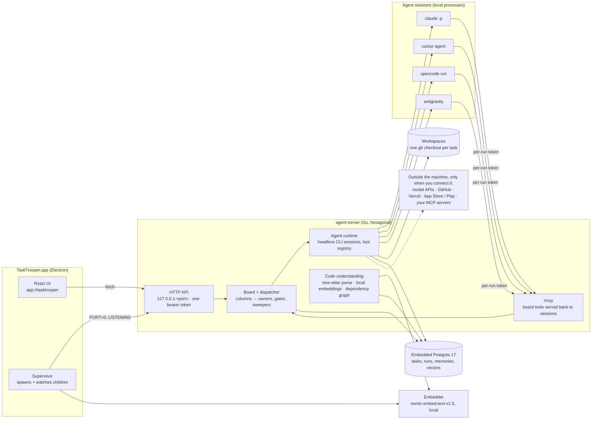

<p align="center">
  <a href="https://tasktrooper.ai"></a>
</p>

<p align="center">
  <a href="https://tasktrooper.ai"></a>
  <a href="https://github.com/makifbaysal/tasktrooper/releases"></a>
  <a href="LICENSE"></a>
  
  
  
  <a href="#install"></a>
</p>

<p align="center">
  
</p>
# TaskTrooper

**Website:** [tasktrooper.ai](https://tasktrooper.ai) · **Docs:** [tasktrooper.ai/docs](https://tasktrooper.ai/docs) · **Download:** [Releases](https://github.com/makifbaysal/tasktrooper/releases)

A local-first agent platform for software teams of one. A board of tasks, a set
of role agents (product manager, architect, backend, frontend, QA), and a
runtime that hands each task to Claude Code (or another agent CLI) on your own
machine — clone, plan, implement, test, open the PR — while you watch the run.

Everything runs on your Mac: the desktop app starts an embedded Postgres and the
Go backend, serves the UI, and runs the agent sessions locally. No account, no
cloud, no login.

**You don't drive the agents, the board does.** Put a task on the board and the
agent that owns its column picks it up on its own, does the work and hands the
task on to the next column, where the next agent takes over. Nobody has to press
run.

**A usage limit doesn't lose work.** When Claude Code runs out of its usage
limit in the middle of a task, the agent stops and the task waits on Blocked.
Once the limit resets, TaskTrooper resumes the same Claude Code session, so the
agent carries on from where it stopped instead of starting over.

## Features

### Board

- A Kanban board with thirteen columns out of the box, from Backlog to Released,
  including analysis review, code review, QA, PM UAT and human UAT. The columns,
  and which agents pick up work in each, are configurable.
- Agents take tasks by themselves. A task that lands in a column is dispatched
  to that column's agent automatically and moves on when the agent is done.
- Tasks carry acceptance criteria. A task cannot move forward out of a review
  column until every criterion has a verdict.
- Tasks can block each other; a blocked task waits until its blocker is done.
- Every task gets its own branch and pull request. Code review reads the PR;
  once it is signed off, a dedicated release engineer merges it, ships it per
  the component's delivery profile, verifies production afterward, and
  finishes or rolls back the release — never on a green deploy alone.
- When Claude Code hits its usage limit, the task is parked on Blocked until the
  limit resets. Then it resumes by itself with `claude --resume` on the parked
  session, so the agent keeps what it already read and wrote and continues from
  where it stopped.

### Role agents

Seven role agents ship with a catalog-driven library of skills, rules and tool
policies — the repo's `catalog/` directory is the source of truth and the
backend syncs it into the database at boot and on an interval. They run on the
connected agent CLI (Claude Code, Cursor, Antigravity or OpenCode) or on a
configured API provider, each taking that runtime's default model unless an
agent is given its own.

| Agent | Works on |
|---|---|
| `product-manager` | backlog, requirements, PM UAT |
| `system-architect` | analysis tasks, task breakdown, code review |
| `backend-developer` | APIs, databases and tests (Go, Java/Quarkus) |
| `frontend-developer` | React, Vite and Tailwind UIs |
| `mobile-developer` | Flutter, SwiftUI, Compose, store releases |
| `qa-agent` | manual test rounds with real requests and headless-browser screenshots; it cannot pass a task without running something |
| `release-engineer` | merges signed-off work, ships it, verifies production and rolls back what breaks — the only agent that touches Done and Released |

Every agent is editable: provider and model, tool policy, effort, skills, rules,
the columns it works, and its memory. You can chat with any agent directly, or
about a specific task.

- **Your own agents.** Create an agent from a template or from scratch with its
  own prompt, skills, rules, tool policy, columns and memory, and save any agent
  as a template for the next one.
- **One board, several CLIs.** The runtime is chosen per agent, not per
  install. A developer on Claude Code, a reviewer on the Cursor CLI, a QA agent
  on OpenCode and an API-only agent on Gemini can all work the same board, each
  in its own session.

### Self-evolution

Agents rewrite their own playbooks from how their work actually went.

- **Reflection.** On a schedule, whenever a task is sent back to Need Revision,
  or on demand, an agent reviews everything since its last reflection: its
  runs, chat messages, revision comments, scores, KPI results and its current
  skills, rules and memories. It proposes changes to all three. Skill and rule
  changes are applied only for agents with self-evolution turned on.
- **Golden gate.** With the gate enabled, a golden task suite runs before and
  after a proposed change, and an independent judge model decides whether to
  keep it. If the pass rate drops, the whole change set is reverted
  automatically.
- **Impact tracking.** Each applied change is later classified as effective,
  regressed or neutral by comparing scores before and after it. Regressions are
  put in front of the agent's next reflection, which decides whether to revert.
- **Budgets and history.** Skills and rules are capped per agent (25 and 15 by
  default), so an agent merges and updates instead of piling up. Every write to
  a skill or rule is versioned with its source (you, self-evolution or the
  upstream catalog) and any version can be restored.
- **KPIs.** Each agent has targets such as tasks completed, first-pass rate,
  revisions received, UAT failures, failed runs and time spent per column,
  measured per day, week or month. The targets are part of the agent's prompt,
  and the Performance page shows how it is doing.

### Memory and code understanding

- Agents save and search memories in four scopes: personal or team-wide, for one
  repository or for every repository. Notes about a single run are refused, and
  a near-duplicate is not saved twice.
- Repositories are parsed with tree-sitter and embedded on your machine with the
  bundled `nomic-embed-text-v1.5` model, so agents search code semantically and
  see uncommitted edits without a re-index.
- Skills are loaded on demand, so a long skill list does not fill the prompt.
- Files uploaded to a workspace are available to agents through retrieval.

### Runtimes, models and tools

- Agent CLIs run as local processes: Claude Code, Cursor, Antigravity and
  OpenCode. A Claude Code session gets TaskTrooper's board tools over MCP with a
  per-run token, and never loads a repository's `.mcp.json` or your personal
  Claude Code settings.
- API providers for agents that do not use a CLI: OpenAI, Anthropic, Google
  Gemini, Groq, or any OpenAI-compatible endpoint such as LM Studio, Ollama or
  vLLM.
- Connect your own MCP servers.
- Built-in tools: terminal, file editing, web search with no API key, page
  fetch, headless-browser QA, and a boilerplate catalog to start new projects
  from.
- A repository's own version pins (`.tool-versions`, `go.mod`, `.nvmrc` and
  others) are honoured in the agent session.

### Integrations and operations

- **GitHub:** clone, branches, pull requests, review comments, merge, and CI
  status from GitHub Actions.
- **Deploys:** a recipe catalog for Google Cloud Run and GKE, AWS ECS and Lambda,
  Vercel and Fly, rendered into a workflow per environment with a health check,
  plus a deployment matrix. A Vercel account can be connected to bind existing
  projects.
- **Production incidents:** alerts from Alertmanager, Sentry, Cloud Monitoring or
  any JSON webhook, together with a health monitor, fold into deduplicated
  incidents with a suggested remedy: a rollback, a config, dependency or
  capacity fix, or a code defect. Per repository you choose whether an incident
  is only recorded, becomes a diagnosis task, or is fixed through the board.
- **Mobile releases:** connect App Store Connect and Google Play and promote
  builds through internal, external and production channels. QA can drive iOS
  simulators and Android emulators on this Mac through Appium.
- **Usage:** token usage per model and per day.

### First run

A guided setup checks this Mac (git, the agent CLIs you have, and optionally
Chrome, Xcode, Appium and the Android SDK), lets you connect any of Claude Code,
Cursor, Antigravity and OpenCode, or an API provider with your own key, then
connects GitHub and imports your first project.

## Install

```sh
curl -fsSL https://raw.githubusercontent.com/makifbaysal/tasktrooper/main/scripts/install.sh | bash
```

It downloads the latest release's universal `.dmg`, copies TaskTrooper into
`/Applications`, and prints the commands for anything else you need. Pass `-y`
to replace an existing install without being asked.

With Homebrew once this repository is public; the repository is its own tap:

```sh
brew tap makifbaysal/tasktrooper https://github.com/makifbaysal/tasktrooper
brew install --cask tasktrooper
```

The app is ad-hoc signed and not notarized yet, so a copy you
install by hand may need right-click → Open the first time; the install script
and the cask both clear the quarantine flag for you.

First launch downloads two things into the app's data directory: the Postgres
binaries (~30 MB) and the embedding model (~140 MB). You need `git` and at least
one way to run agents: the Claude Code, Cursor, Antigravity or OpenCode CLI, or
an API key for a model provider. The app checks what is installed and shows the
exact command for anything missing.

Or grab the `.dmg` from [Releases](https://github.com/makifbaysal/tasktrooper/releases) and drag TaskTrooper to Applications.

On **Windows**, download `TaskTrooper-<version>-setup.exe` from Releases and run
it. On **Linux**, use `TaskTrooper-<version>-x86_64.AppImage` (`chmod +x`, then
run it) or install the `.deb`. Neither is code-signed yet, so Windows SmartScreen
asks you to confirm the first time. The install script and Homebrew are
macOS-only.

## Run from source

```sh
make setup      # go mod download + npm ci (desktop, desktop/ui)
make desktop    # Electron app in dev mode
make dev        # or: backend + UI dev server, open http://localhost:3200
make package    # build the installer for this OS into desktop/release
```

## Layout

```
server/       Go backend — API, board, agent loop, tools, embedded Postgres
desktop/      Electron shell — supervises the backend + embedder, serves the UI
desktop/ui/   React UI — bundled into the app; runs in a browser for development
docs/         user docs (rendered at tasktrooper.ai/docs) — start with docs/README.md
```

Each directory has its own `README.md` and `CLAUDE.md`.

## Architecture

One machine, three processes, one window. Nothing is hosted.



- **Local only.** The desktop generates one bearer token, passes it to the
  server as `SERVER_API_KEY` and to the page; the listener binds `127.0.0.1`.
- **The desktop is the backend's supervisor.** It spawns `agent-server` with
  `PORT=0`, reads the `LISTENING` line, polls `/health`, then opens the window.
- **The server owns its database.** Empty `DATABASE_URL` means it starts its
  own Postgres from the bundled binaries under the data directory.
- **Agents are child processes, not a service.** Each task run is one headless
  CLI session with a per-run MCP token; the repo's `.mcp.json` and your
  personal CLI settings are never loaded.
- **Code understanding stays on the machine.** Repositories are parsed with
  tree-sitter and embedded with the bundled model; the vectors live in the same
  Postgres.

The long version: [docs/architecture.md](docs/architecture.md).

## How a task runs

1. You put a card on the board (or a product-manager agent drafts it).
2. The backend prepares a git workspace under the data directory and starts a
   headless `claude -p` session with the agent's prompt, skills and a per-run
   MCP token that lets the session update acceptance criteria and move the
   card.
3. The session's output streams to the card. When it finishes, QA agents run
   the test round; CI status is polled from GitHub Actions.
4. The card moves through the columns you configured; a PR is opened on the
   task branch.

## Configuration

The desktop app needs none. For `make dev`, `scripts/dev.sh` writes
`server/.env.local` on first run; see `server/README.md` for every variable.

## How it compares

<!-- compare:start -->

### Local-first peers

Open-source projects that also put coding agents to work on your own machine. The short version: they give you a tracker, a queue or a session manager that you drive; TaskTrooper is the whole loop in one desktop app, and the board drives it.

| | [TaskTrooper](https://github.com/makifbaysal/tasktrooper) | [Beads](https://github.com/steveyegge/beads) | [Beadhive / Gas City](https://beadhive.ai) | [Vibe Kanban](https://github.com/BloopAI/vibe-kanban) | [Claude Squad](https://github.com/smtg-ai/claude-squad) |
|---|---|---|---|---|---|
| What it is | Desktop app: board, role agents and the runtime that runs them | Git-embedded issue tracker and memory for agents (`bd` CLI) | Software factory on top of Beads (`bh` CLI; Gas City orchestrates it) | Kanban and per-task workspaces for coding agents (announced as sunsetting) | TUI that runs many agent sessions side by side |
| Who starts the work | The board: a card entering a column is dispatched to that column's agent | You, or an agent you are already running | Its planner/dispatcher agents, behind human gates | You, per task | You, per session |
| Roles | Seven seeded agents (PM, architect, backend, frontend, mobile, QA, release engineer) with skills and rules that rewrite themselves from results | None, it tracks work for any agent | Planner, dispatcher, developer, reviewer, merger, warden | None | None |
| Your own agents | Create agents from a template or from scratch: prompt, skills, rules, tool policy, columns, memory. Each agent picks its own runtime, so one board mixes Claude Code, Cursor, OpenCode, Antigravity and API models | No agents; bring your own | Roles are configured in the factory; agents run through its CLI | Pick a supported agent per task; no agent definitions | Pick a program per session; no agent definitions |
| Parallel agents and tools | Several tasks at once (three sessions by default), each in its own workspace, branch and CLI session; each role has its own tool policy, so the backend agent runs tests while QA drives a browser and the architect reads a third task's PR. QA has no code tools | Any number of agents share the graph; what each may do is up to the agent you run | Role agents on one graph; tool separation by role | One agent per task, same capabilities | Several sessions side by side, each a full agent |
| Lifecycle | Thirteen columns out of the box: analysis review, code review, QA, PM UAT, human UAT, Done and Released owned by a release engineer | Open/closed with typed dependencies | Plan, review, merge with human gates | Todo, in progress, review | Branch, diff, commit |
| QA | A QA agent that cannot pass a task without running something: real requests, headless browser, iOS/Android simulators | None | Reviewer agents | None | None |
| After merge | Deploy recipes, health checks, incidents from Alertmanager/Sentry/webhooks, rollback, App Store and Play releases | None | Release automation | None | None |
| Work ordering | `blocked_by`, `deploy_depends_on`, `derived_from`, `discovered_from`; a ready queue for agents | `blocks`, `parent-child`, `discovered-from`, `related`; `bd ready` | Beads' graph | None | None |
| Storage | Embedded Postgres in the app's data directory | Dolt under `.beads/`, synced through git | Beads | Local database, or a self-hosted server | tmux sessions and git worktrees |
| Agent runtimes | Claude Code, Cursor, Antigravity, OpenCode as local processes; OpenAI, Anthropic, Gemini, Groq or any OpenAI-compatible API | Any agent that can call a CLI | Any, through its CLI | Claude Code, Codex, Gemini CLI, Copilot, Amp, Cursor, OpenCode and more | Claude Code, Codex, Gemini, Aider |
| Interface | Desktop app (macOS, Windows, Linux) | CLI, plus community UIs | CLI | Web UI | Terminal UI |
| License | Apache-2.0 | MIT | See their repositories | Apache-2.0 | AGPL-3.0 |

### Hosted and single-agent tools

The agent products most people already use. Several of these are what TaskTrooper runs underneath rather than rivals: it needs Claude Code or another agent CLI installed, and it reads the PRs and CI these tools produce.

| | [TaskTrooper](https://github.com/makifbaysal/tasktrooper) | [Claude Code](https://claude.com/claude-code) | [Cursor Cloud Agents](https://cursor.com/docs/cloud-agent) | [Devin](https://devin.ai) | [Copilot coding agent](https://docs.github.com/en/copilot/concepts/agents/coding-agent/about-coding-agent) | [OpenHands](https://github.com/OpenHands/OpenHands) | [Xirp](https://xirp.spotify.com/) |
|---|---|---|---|---|---|---|---|
| What it is | Desktop app: board, role agents and the runtime that runs them | Terminal agent; one session you drive | Parallel agents in cloud VMs that open PRs | Cloud AI engineer you assign tickets to | Assign an issue, get a PR from an Actions runner | Self-hosted control center for agents and automations | Agent grounded in your organisation's services and docs |
| Where it runs | Your Mac: embedded Postgres, Go backend, local agent sessions | Your terminal | Cursor's cloud VMs | Cognition's cloud (CLI for local) | GitHub Actions, ephemeral | Local, Docker, remote VM or OpenHands Cloud | Desktop app plus a Portal plugin; beta |
| Who starts the work | The board, by column | You, per prompt | You, from Cursor, Slack, GitHub, Linear | You, by ticket, Slack or web | You, by issue or @copilot; schedules | You, or an automation on schedule/webhook | You, in a session |
| Roles | Seven role agents with skills, rules, tool policies and memory | One agent per session | One agent kind | One Devin, many sessions | One agent | Agents by profile, no role model | One agent |
| Your own agents | Create agents from a template or from scratch; each picks its own CLI or API model, so one board mixes runtimes | Subagents and skills inside one CLI | Rules files; one agent kind | One Devin | One agent | Agent profiles per server; ACP agents | One agent |
| Parallel agents and tools | Three sessions by default, each in its own workspace and CLI session, each role with its own tool policy; QA has no code tools | More terminals; every session can do everything you allow | As many agents as you start, same capabilities | Many sessions, each the same Devin | One session per issue, 59-minute cap | Multiple servers and conversations; no role separation | One session kind |
| Lifecycle | Thirteen columns: analysis review, code review, QA, PM UAT, human UAT, merge and release owned by a release engineer | None | Task in, PR out | Ticket to draft PR; take over in its IDE | Issue to PR | Conversation and task list | Work items and sessions in a workspace |
| QA | A separate QA agent that must execute: requests, browser, simulators | Whatever you ask it to run | Self-verification with screenshots and logs | Self-tests; your CI | Your CI on the PR | Whatever the agent runs | Not part of the product |
| After merge | Deploy recipes, health checks, incidents, rollback, store releases | None | None | None | None | Scriptable automations | Not part of the product |
| Usage limits | Each task parks with a resume time, other runs are held, sessions resume with --resume; unattended | Interactive session waits and continues at reset (esc to cancel); headless runs do not | Spend limit per agent at API rates | Plan limits | Premium request quota per plan | Your provider's limits | Beta |
| Data | Stays on the machine | Your machine; model calls to Anthropic | Code leaves your machine | Repos and secrets in Devin's environment | GitHub-hosted repos only | Wherever you host it | Your organisation's portal |
| Price | Free, Apache-2.0; your own model or CLI subscription | Claude subscription or API | Cursor plan plus API-rate usage | Individual and Teams plans | Paid Copilot plans | Free, MIT; cloud option | Beta; plans page |
| Runs under TaskTrooper? | — | Yes, the default runtime | Yes, the Cursor CLI | No | No; its PRs and CI are read | No | No |

Per-project write-ups, same content as [tasktrooper.ai/compare](https://tasktrooper.ai/compare):

- [TaskTrooper vs Claude Code](docs/compare/claude-code.md) — The terminal agent TaskTrooper runs underneath.
- [TaskTrooper vs Cursor Cloud Agents](docs/compare/cursor.md) — Parallel agents in cloud VMs that open merge-ready PRs.
- [TaskTrooper vs Devin](docs/compare/devin.md) — A cloud AI engineer you assign tickets to from Slack, Linear or Jira.
- [TaskTrooper vs GitHub Copilot coding agent](docs/compare/github-copilot.md) — Assign an issue to Copilot and get a PR from a GitHub Actions runner.
- [TaskTrooper vs OpenHands](docs/compare/openhands.md) — A self-hosted control center for coding agents and automations.
- [TaskTrooper vs Xirp](docs/compare/xirp.md) — An agent grounded in your organisation's services, docs and architecture decisions.
- [TaskTrooper vs Beads](docs/compare/beads.md) — A git-embedded, dependency-aware issue tracker and memory for coding agents.
- [TaskTrooper vs Beadhive and Gas City](docs/compare/beadhive.md) — A CLI software factory on top of Beads, with role agents and human gates.
- [TaskTrooper vs Vibe Kanban](docs/compare/vibe-kanban.md) — A kanban board where each task gets a branch, a terminal and a dev server.
- [TaskTrooper vs Claude Squad](docs/compare/claude-squad.md) — A terminal UI that runs many agent sessions in tmux and git worktrees.

<!-- compare:end -->

## License

Apache-2.0. See `LICENSE`.
