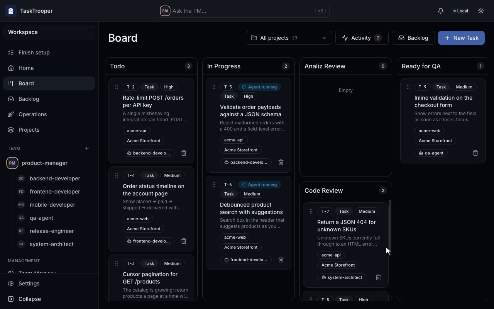
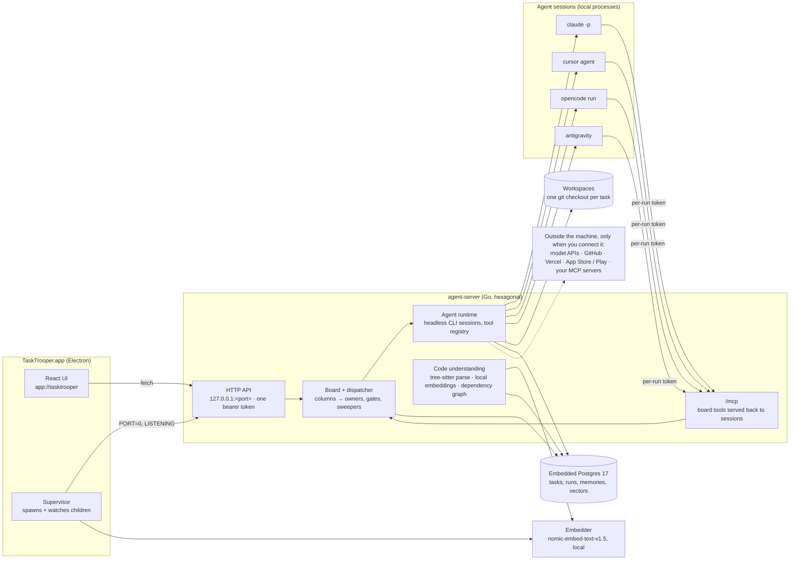

<p align="center">
  <a href="https://tasktrooper.ai"></a>
</p>

<p align="center">
  <a href="https://tasktrooper.ai"></a>
  <a href="https://github.com/makifbaysal/tasktrooper/releases"></a>
  <a href="LICENSE"></a>
  
  
  
  <a href="#install"></a>
</p>

<p align="center">
  
</p>
# TaskTrooper

**Website:** [tasktrooper.ai](https://tasktrooper.ai) · **Docs:** [tasktrooper.ai/docs](https://tasktrooper.ai/docs) · **Download:** [Releases](https://github.com/makifbaysal/tasktrooper/releases)

A local-first agent platform for software teams of one. A board of tasks, a set
of role agents (product manager, architect, backend, frontend, QA), and a
runtime that hands each task to an agent CLI on your own machine — Claude Code,
Cursor, Antigravity or OpenCode — or to a model API you bring a key for: clone,
plan, implement, test, open the PR, while you watch the run.

Everything runs on your machine: the desktop app starts an embedded Postgres and the
Go backend, serves the UI, and runs the agent sessions locally. No account, no
cloud, no login.

**You don't drive the agents, the board does.** Put a task on the board and the
agent that owns its column picks it up on its own, does the work and hands the
task on to the next column, where the next agent takes over. Nobody has to press
run.

**A usage limit doesn't lose work.** When an agent CLI runs out of its usage
limit in the middle of a task, the agent stops and the task waits on Blocked
instead of failing. Once the limit resets, TaskTrooper picks the task back up by
itself; on a CLI that can resume a session, such as Claude Code, the agent
carries on from where it stopped instead of starting over.

## Features

### Board

- A Kanban board with thirteen columns out of the box, from Backlog to Released,
  including analysis review, code review, QA, PM UAT and human UAT. The columns,
  and which agents pick up work in each, are configurable.
- Agents take tasks by themselves. A task that lands in a column is dispatched
  to that column's agent automatically and moves on when the agent is done.
- Tasks carry acceptance criteria. A task cannot move forward out of a review
  column until every criterion has a verdict.
- Tasks can block each other; a blocked task waits until its blocker is done.
- Every task gets its own branch and pull request. Code review reads the PR;
  once it is signed off, a dedicated release engineer merges it, ships it per
  the component's delivery profile, verifies production afterward, and
  finishes or rolls back the release — never on a green deploy alone.
- When an agent CLI hits its usage limit, the task is parked on Blocked until
  the limit resets, and other runs on the same CLI are held instead of hitting
  the same wall. Then the task continues by itself. Claude Code resumes the
  parked session (`--resume`), so the agent keeps what it already read and
  wrote.

### Role agents

Eight role agents ship with a catalog-driven library of skills, rules and tool
policies — the repo's `catalog/` directory is the source of truth and the
backend syncs it into the database at boot and on an interval. They run on the
connected agent CLI (Claude Code, Cursor, Antigravity or OpenCode) or on a
configured API provider, each taking that runtime's default model unless an
agent is given its own.

| Agent | Works on |
|---|---|
| `product-manager` | backlog, requirements, PM UAT |
| `system-architect` | analysis tasks, task breakdown, code review |
| `backend-developer` | APIs, databases and tests (Go, Java/Quarkus) |
| `frontend-developer` | React, Vite and Tailwind UIs |
| `mobile-developer` | Flutter, SwiftUI, Compose, store releases |
| `qa-agent` | manual test rounds with real requests and headless-browser screenshots; it cannot pass a task without running something |
| `ui-designer` | the project's design system and screen designs, approved before they are built |
| `release-engineer` | merges signed-off work, ships it, verifies production and rolls back what breaks — the only agent that touches Done and Released |

Every agent is editable: provider and model, tool policy, effort, skills, rules,
the columns it works, and its memory. You can chat with any agent directly, or
about a specific task.

- **Your own agents.** Create an agent from a template or from scratch with its
  own prompt, skills, rules, tool policy, columns and memory, and save any agent
  as a template for the next one.
- **One board, several CLIs.** The runtime is chosen per agent, not per
  install. A developer on Claude Code, a reviewer on the Cursor CLI, a QA agent
  on OpenCode and an API-only agent on Gemini can all work the same board, each
  in its own session.

### Self-evolution

Agents rewrite their own playbooks from how their work actually went.

- **Reflection.** On a schedule, whenever a task is sent back to Need Revision,
  or on demand, an agent reviews everything since its last reflection: its
  runs, chat messages, revision comments, scores, KPI results and its current
  skills, rules and memories. It proposes changes to all three. Skill and rule
  changes are applied only for agents with self-evolution turned on.
- **Golden gate.** With the gate enabled, a golden task suite runs before and
  after a proposed change, and an independent judge model decides whether to
  keep it. If the pass rate drops, the whole change set is reverted
  automatically.
- **Impact tracking.** Each applied change is later classified as effective,
  regressed or neutral by comparing scores before and after it. Regressions are
  put in front of the agent's next reflection, which decides whether to revert.
- **Budgets and history.** Skills and rules are capped per agent (25 and 15 by
  default), so an agent merges and updates instead of piling up. Every write to
  a skill or rule is versioned with its source (you, self-evolution or the
  upstream catalog) and any version can be restored.
- **KPIs.** Each agent has targets such as tasks completed, first-pass rate,
  revisions received, UAT failures, failed runs and time spent per column,
  measured per day, week or month. The targets are part of the agent's prompt,
  and the Performance page shows how it is doing.

### Memory and code understanding

- Agents save and search memories in four scopes: personal or team-wide, for one
  repository or for every repository. Notes about a single run are refused, and
  a near-duplicate is not saved twice.
- Repositories are parsed with tree-sitter and embedded on your machine with the
  bundled `nomic-embed-text-v1.5` model, so agents search code semantically and
  see uncommitted edits without a re-index.
- Skills are loaded on demand, so a long skill list does not fill the prompt.
- Files uploaded to a workspace are available to agents through retrieval.

### Runtimes, models and tools

- Agent CLIs run as local, headless processes: Claude Code, Cursor, Antigravity
  and OpenCode. Every session gets TaskTrooper's board tools over MCP with a
  per-run token that is revoked when the run ends.
- API providers for agents that do not use a CLI: OpenAI, Anthropic, Google
  Gemini, Groq, or any OpenAI-compatible endpoint such as LM Studio, Ollama or
  vLLM.
- Connect your own MCP servers.
- Built-in tools: terminal, file editing, web search with no API key, page
  fetch, headless-browser QA, and a boilerplate catalog to start new projects
  from.
- A repository's own version pins (`.tool-versions`, `go.mod`, `.nvmrc` and
  others) are honoured in the agent session.

### Integrations and operations

- **GitHub:** clone, branches, pull requests, review comments, merge, and CI
  status from GitHub Actions.
- **Deploys:** a recipe catalog for Google Cloud Run and GKE, AWS ECS and Lambda,
  Vercel and Fly, rendered into a workflow per environment with a health check,
  plus a deployment matrix. A Vercel account can be connected to bind existing
  projects.
- **Production incidents:** alerts from Alertmanager, Sentry, Cloud Monitoring or
  any JSON webhook, together with a health monitor, fold into deduplicated
  incidents with a suggested remedy: a rollback, a config, dependency or
  capacity fix, or a code defect. Per repository you choose whether an incident
  is only recorded, becomes a diagnosis task, or is fixed through the board.
- **Mobile releases:** connect App Store Connect and Google Play and promote
  builds through internal, external and production channels. QA can drive iOS
  simulators (macOS only) and Android emulators on this machine through Appium.
- **Usage:** token usage per model and per day.

### First run

A guided setup checks this machine (git, the agent CLIs you have, and optionally
Chrome, Xcode, Appium and the Android SDK), lets you connect any agent CLI you
have (Claude Code, Cursor, Antigravity, OpenCode) or an API provider with your
own key, then connects GitHub and imports your first project.

## Install

```sh
curl -fsSL https://raw.githubusercontent.com/makifbaysal/tasktrooper/main/scripts/install.sh | bash
```

It downloads the latest release's universal `.dmg`, copies TaskTrooper into
`/Applications`, and prints the commands for anything else you need. Pass `-y`
to replace an existing install without being asked.

With Homebrew once this repository is public; the repository is its own tap:

```sh
brew tap makifbaysal/tasktrooper https://github.com/makifbaysal/tasktrooper
brew install --cask tasktrooper
```

The app is ad-hoc signed and not notarized yet, so a copy you
install by hand may need right-click → Open the first time; the install script
and the cask both clear the quarantine flag for you.

First launch downloads two things into the app's data directory: the Postgres
binaries (~30 MB) and the embedding model (~140 MB). You need `git` and at least
one way to run agents: an agent CLI (Claude Code, Cursor, Antigravity or
OpenCode), or an API key for a model provider. The app checks what is installed and shows the
exact command for anything missing.

Or grab the `.dmg` from [Releases](https://github.com/makifbaysal/tasktrooper/releases) and drag TaskTrooper to Applications.

On **Windows**, download `TaskTrooper-<version>-setup.exe` from Releases and run
it. On **Linux**, use `TaskTrooper-<version>-x86_64.AppImage` (`chmod +x`, then
run it) or install the `.deb`. Neither is code-signed yet, so Windows SmartScreen
asks you to confirm the first time. The install script and Homebrew are
macOS-only.

## Run from source

```sh
make setup      # go mod download + npm ci (desktop, desktop/ui)
make desktop    # Electron app in dev mode
make dev        # or: backend + UI dev server, open http://localhost:3200
make package    # build the installer for this OS into desktop/release
```

## Layout

```
server/       Go backend — API, board, agent loop, tools, embedded Postgres
desktop/      Electron shell — supervises the backend + embedder, serves the UI
desktop/ui/   React UI — bundled into the app; runs in a browser for development
docs/         user docs (rendered at tasktrooper.ai/docs) — start with docs/README.md
```

Each directory has its own `README.md` and `CLAUDE.md`.

## Architecture

One machine, three processes, one window. Nothing is hosted.


```mermaid
flowchart LR
  subgraph app["TaskTrooper.app (Electron)"]
    ui["React UI<br/>app://tasktrooper"]
    sup["Supervisor<br/>spawns + watches children"]
  end

  subgraph server["agent-server (Go, hexagonal)"]
    api["HTTP API<br/>127.0.0.1:&lt;port&gt; · one bearer token"]
    board["Board + dispatcher<br/>columns → owners, gates, sweepers"]
    runtime["Agent runtime<br/>headless CLI sessions, tool registry"]
    mcp["/mcp<br/>board tools served back to sessions"]
    ctx["Code understanding<br/>tree-sitter parse · local embeddings · dependency graph"]
  end

  pg[("Embedded Postgres 17<br/>tasks, runs, memories, vectors")]
  emb["Embedder<br/>nomic-embed-text-v1.5, local"]
  ws[("Workspaces<br/>one git checkout per task")]

  subgraph agents["Agent sessions (local processes)"]
    cc["claude -p"]
    cur["cursor agent"]
    oc["opencode run"]
    ag["antigravity"]
  end

  ext["Outside the machine, only when you connect it:<br/>model APIs · GitHub · Vercel · App Store / Play · your MCP servers"]

  ui -- fetch --> api
  sup -- PORT=0, LISTENING --> api
  sup --> emb
  api --> board --> runtime
  runtime --> cc & cur & oc & ag
  cc & cur & oc & ag -- per-run token --> mcp
  mcp --> board
  runtime --> ws
  ctx --> emb
  board & runtime & ctx --> pg
  runtime -.-> ext
```

- **Local only.** The desktop generates one bearer token, passes it to the
  server as `SERVER_API_KEY` and to the page; the listener binds `127.0.0.1`.
- **The desktop is the backend's supervisor.** It spawns `agent-server` with
  `PORT=0`, reads the `LISTENING` line, polls `/health`, then opens the window.
- **The server owns its database.** Empty `DATABASE_URL` means it starts its
  own Postgres from the bundled binaries under the data directory.
- **Agents are child processes, not a service.** Each task run is one headless
  CLI session with a per-run MCP token, on whichever CLI that agent is set to.
- **Code understanding stays on the machine.** Repositories are parsed with
  tree-sitter and embedded with the bundled model; the vectors live in the same
  Postgres.

The long version: [docs/architecture.md](docs/architecture.md).

## How a task runs

1. You put a card on the board (or a product-manager agent drafts it).
2. The backend prepares a git workspace under the data directory and starts a
   headless session on the agent's runtime (`claude -p`, `cursor-agent -p`,
   `agy -p` or `opencode run`, or an API model) with the agent's prompt, skills
   and a per-run MCP token that lets the session update acceptance criteria and move the
   card.
3. The session's output streams to the card. When it finishes, QA agents run
   the test round; CI status is polled from GitHub Actions.
4. The card moves through the columns you configured; a PR is opened on the
   task branch.

## Configuration

The desktop app needs none. For `make dev`, `scripts/dev.sh` writes
`server/.env.local` on first run; see `server/README.md` for every variable.

## How it compares

<!-- compare:start -->

### Side by side

Four tools that also put coding agents to work for you. They stop at the pull request or the commit; TaskTrooper carries the task through QA, merge, deploy and production, and the board starts the work.

| | [TaskTrooper](https://github.com/makifbaysal/tasktrooper) | [Orca](https://www.onorca.dev) | [bb](https://getbb.app) | [Modula](https://modula.sh) | [Teleclod](https://teleclod.com) |
|---|---|---|---|---|---|
| What it is | Desktop app: board, role agents and the runtime that runs them | IDE that runs many agent CLIs side by side, one git worktree per task | Agent IDE built from plugins; desktop, web, CLI and API | Event-driven pipeline of agents that turns tickets into code | Dashboard for Claude Code and Codex sessions, run from your phone |
| Who starts the work | The board: a card entering a column is dispatched to that column's agent | You, per worktree; experimental agent-to-agent orchestration | You, per thread, or scripts and cron | Agent rules that match events, after a human approves the task | You describe the task; an agent plans it and waits for approval |
| Roles | Seven seeded agents (PM, architect, backend, frontend, mobile, QA, release engineer) with skills and rules that rewrite themselves from results | None | None; manager threads coordinate others | Project manager, researcher, worker, code reviewer, reviewer, plus Jira/Linear/GitHub scan agents | One agent per task; a different model per phase |
| Isolation | Local clone and branch per task | Git worktree per task | Worktree, live checkout, scratch folder or Modal sandbox | Git worktree per solution variant | Not described |
| Review | Pull request per task; every acceptance criterion needs a verdict | In-app diff; line comments go back to the agent as one prompt | Diff panel with path filters | Reviewer agents, then an in-app diff for the human | Findings against your rules by severity; you approve before commit |
| QA | A QA agent that cannot pass a task without running something: real requests, headless browser, iOS/Android simulators | Whatever the agent runs; embedded browser | None built in | None | Review against your rules; agents can check your Chrome tabs |
| After merge | Deploy recipes, production checks, rollback, incidents from Alertmanager/Sentry/webhooks, App Store and Play releases | None | None | None | None |
| Agent runtimes | Claude Code, Cursor, Antigravity, OpenCode as local processes; OpenAI, Anthropic, Gemini, Groq or any OpenAI-compatible API | 30+ agent CLIs | Claude Code, Codex, Cursor, OpenCode, Grok, Pi and other ACP agents | Claude Code, Codex, OpenCode, Gemini CLI | Claude Code, Codex, Gemini, Kimi CLI and API providers |
| Remote access | None; nothing hosted | SSH hosts, remote server, iOS/Android through a relay | Several machines, bb connect, Tailscale, iOS | Closed-source plugin | Phone, browser and Chrome through a relay; Docker |
| Storage | Embedded Postgres in the app's data directory | SQLite | SQLite | SQLite under `~/.modula` | Encrypted SQLite in the project folder |
| Interface | Desktop app (macOS, Windows, Linux) | Desktop app plus mobile apps | Desktop, web, CLI, iOS | Desktop app and CLI | Desktop app, phone, Chrome extension |
| License and price | Apache-2.0, free | MIT, free | MIT, free | Elastic License 2.0, free | Proprietary; free tier, €49 and €99 per month |

Per-project write-ups, same content as [tasktrooper.ai/compare](https://tasktrooper.ai/compare):

- [TaskTrooper vs Orca](docs/compare/orca.md) — An IDE that runs many coding agents side by side, each in its own git worktree.
- [TaskTrooper vs bb](docs/compare/bb.md) — An agent IDE built from plugins, driven from a desktop app, the web, a CLI or an API.
- [TaskTrooper vs Modula](docs/compare/modula.md) — An event-driven pipeline that turns tickets into code with a team of agents.
- [TaskTrooper vs Teleclod](docs/compare/teleclod.md) — A dashboard for many Claude Code and Codex sessions that you run from your phone.

<!-- compare:end -->

## License

Apache-2.0. See `LICENSE`.
