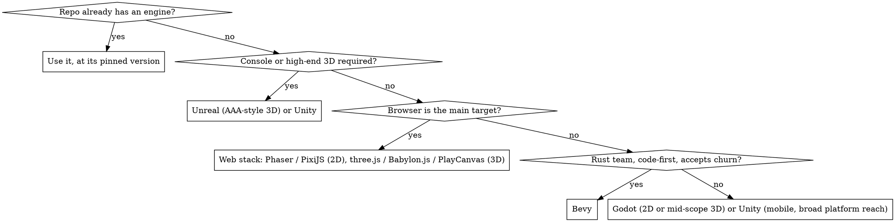

# Game Engine Choice

## Overview

Choosing an engine is a one-way door: assets, scenes, scripts, editor tooling and the team's skills all bind to it. On an existing project there is nothing to choose — the engine and the exact editor version in the repository are the answer. The choice only opens for a brand-new game (or when the analiz task explicitly decides it), and then it is made from the target platforms first, not from preference.

**Core principle:** The repository's engine and pinned version win. For a new game, the platform list decides most of the choice before taste gets a vote.

## Step 1 — read what the repository already says

| Signal | Engine | Version lives in |
|---|---|---|
| `ProjectSettings/ProjectVersion.txt` | Unity | `m_EditorVersion: 6000.3.xf1` |
| `project.godot` | Godot | `config/features=PackedStringArray("4.7", ...)`; a `.csproj` beside it means Godot .NET |
| `*.uproject` | Unreal Engine | `"EngineAssociation": "5.6"` (a GUID means a source build) |
| `package.json` with `phaser`, `pixi.js`, `three`, `@babylonjs/core`, `playcanvas`, `excalibur`, `kaplay` | web engine | the lockfile's resolved version |
| `Cargo.toml` with `bevy` | Bevy | `Cargo.lock` — the minor version is the API |
| `game.project` | Defold | `[project]` / `bob.jar` version in CI |
| `.csproj` referencing `MonoGame.Framework.*` | MonoGame | the package version |
| `pygame` / `pygame-ce` in `pyproject.toml` / `requirements.txt` | pygame | the pin |

Found one? Stop here and use it. Never open the project in a different editor version: Unity and Unreal re-serialize assets on open and Godot rewrites `project.godot` and import files, producing a diff nobody asked for.

## Step 2 — only for a new game

## Decision table

| Need | Strong fit | Watch out for |
|---|---|---|
| 2D, small-to-mid scope, desktop + mobile | Godot (GDScript), Unity, Defold | Godot console ports go through third-party porting partners |
| 2D in the browser, instant load | Phaser (framework), PixiJS (renderer only), KAPLAY / Excalibur (small games), Defold (HTML5 export) | PixiJS gives you no scenes, physics, input or audio — you add them |
| 3D in the browser | three.js (largest ecosystem), Babylon.js (batteries included, Havok physics, NullEngine for tests), PlayCanvas (editor-centred) | Download size and mobile GPU limits; WebGPU only where the repo opts in |
| Mobile 3D with broad device reach | Unity (URP) | Build size; per-platform texture compression |
| High-fidelity 3D, consoles, large teams | Unreal Engine 5 | C++ build times, editor weight, no web export |
| Cross-platform incl. consoles, C# team | Unity | Console SDKs need platform-holder developer accounts |
| Data-heavy simulation, thousands of entities | Unity DOTS, Bevy, Unreal Mass | ECS raises the cost of simple gameplay code |
| Code-first Rust, open source | Bevy | A breaking release every few months — pin the minor and budget migrations |
| C# without an editor, full control | MonoGame | You build tooling (levels, UI) yourself |
| Teaching, jams, Python team | pygame / pygame-ce | Performance ceiling; web only through pygbag |

## Platform reach (verify against the pinned version's docs)

| Engine | Web | Mobile | Desktop | Console |
|---|---|---|---|---|
| Unity 6 | Yes (Web build, heavy first load) | Yes | Yes | Yes, with platform-holder access |
| Godot 4 GDScript | Yes (single-threaded export avoids cross-origin isolation headers) | Yes | Yes | Through third-party porting partners |
| Godot 4 C# (.NET) | **No** — still unsupported in 4.7; choose GDScript for browser targets | Yes | Yes | As above |
| Unreal Engine 5 | No official web export | Yes (heavier) | Yes | Yes, with platform-holder access |
| Phaser / PixiJS / three.js / Babylon.js / PlayCanvas | Native | Mobile browsers; wrap with Capacitor if a store build is needed | Electron/Tauri wrapper | No |
| Bevy | wasm32 (WebGL2 / WebGPU) | Experimental | Yes | No official support |
| Defold | Strong HTML5 | Yes | Yes | Some consoles on request |
| MonoGame | No first-class web | Yes | Yes | Yes, for registered console developers |

## Licensing, at a high level

Not legal advice — read the current terms before committing a team to an engine, and name the terms you read in the decision.

- **Unity:** subscription seats; a free tier below a revenue threshold. The per-install Runtime Fee was cancelled in 2024.
- **Unreal Engine:** free to start; a royalty (5% of gross revenue above a lifetime threshold per title, US$1M at the time of writing) for games.
- **Godot** (MIT), **Bevy** (MIT/Apache-2.0), **three.js, Phaser, PixiJS, KAPLAY** (MIT), **Babylon.js** (Apache-2.0), **Excalibur** (BSD-2), **PlayCanvas engine** (MIT; its hosted editor is a commercial service): no royalties.
- **MonoGame** (Ms-PL), **pygame** (LGPL — fine when linked dynamically as usual), **Defold** (free, Defold License).

## Language and team

- C# team → Unity, Godot .NET (no web), MonoGame.
- C++ team or Blueprint designers → Unreal.
- Scripting-friendly, small team → Godot GDScript.
- TypeScript web team → Phaser / PixiJS / three.js / Babylon.js / Excalibur / KAPLAY.
- Rust team → Bevy.

## Record the decision

The closing message (and the README's first lines on a new repository) states: engine, exact version, the two alternatives considered, and the reason the winner won, tied to the task's platforms. Pin the version the same run: `ProjectVersion.txt`, `config/features`, `EngineAssociation`, an exact `package.json` range plus lockfile, or `bevy = "0.N"` plus `Cargo.lock`.

## Hard rule

Never introduce a second engine (or a second renderer, physics, input or networking stack) into a project that has one. A web game that "needs a bit of 3D" uses the 3D capability of its own stack or a scoped canvas inside it — it does not gain a parallel engine on your initiative. A genuine engine change is a comment for the architect.

## Common Mistakes

- Choosing by preference when the repository already answered the question.
- Godot C# for a game whose task lists the browser as a target.
- Opening a Unity or Unreal project in whatever editor is installed instead of the pinned version.
- Bevy without an exact minor pin, then breaking on the next `cargo update`.
- PixiJS for a game that needs physics, scenes and audio, then rebuilding Phaser by hand.

## Red Flags

- A choice whose only reason is "it's popular" or "I know it best".
- Two engines' packages in one `package.json`, or a `.uproject` beside `ProjectSettings/`.
- An engine version bump in a diff for a task that never asked for one.
